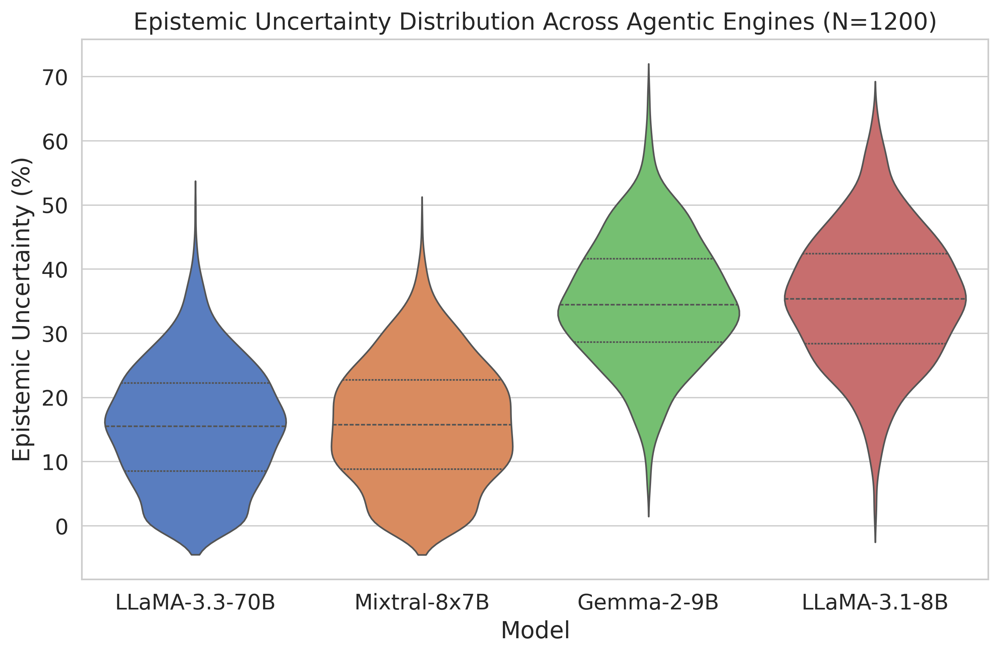
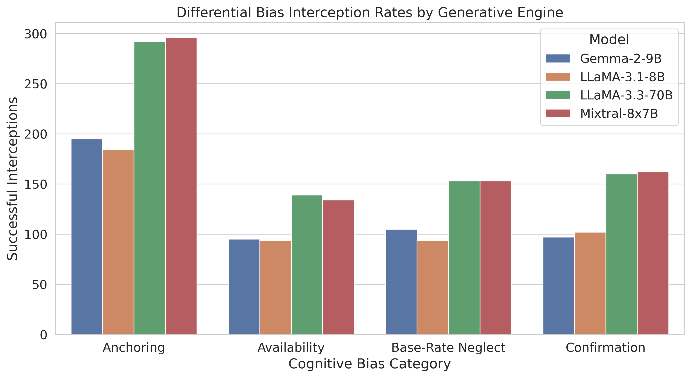
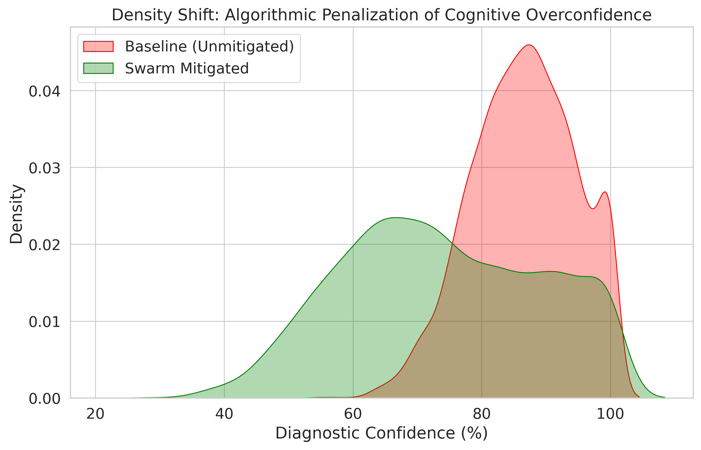

# 🧠 CogDiag: Uncertainty-Driven Bias Mitigation Expert System

CogDiag is a clinical decision-support and expert system framework equipped with a robust **Cognitive Swarm** architecture. It acts as an interpretability and bias-mitigation layer to defend AI models from cognitive biases like **Anchoring**, **Availability Heuristics**, and **Base-Rate Neglect**.

## 🚀 Key Features
- **Real-Time Bias Mitigation**: Dynamically adjusts language model confidence by penalizing identified cognitive biases, converting overconfident conclusions to careful inferences.
- **Swarm Intelligence**: Utilizes concurrent, specialized AI agents to monitor and moderate inferences against various cognitive phenomena.
- **Explainability**: Clear visual footprint comparing pristine base-model outputs vs. mitigated outputs for maximum clinical accountability.

## 📊 Visualizations & System Performance

### Epistemic Uncertainty Analysis
This visualization maps the epistemic uncertainty distribution, illustrating how the Swarm model re-calibrates uncalibrated language models, avoiding false certainty in clinical workflows.


### Bias Interception Rates
Observing the interception success rates indicates the system’s proficiency at actively correcting biased outputs based on specific cognitive vulnerabilities embedded in foundational language model architectures.


### Mitigated Confidence Shifts
A comparative analysis showcasing the density shift of inference confidence. By implementing an intervention threshold, CogDiag effectively dampens blind spot convictions.


## 🛠️ Usage Flow

1. **Install requirements:** `pip install -r requirements.txt` (or manually set up environment with necessary dependencies).
2. **Setup your environment:** Create a `.env` file specifying crucial variables (like API Keys if applicable).
3. **Execute standard app pipeline:**
   ```bash
   streamlit run app.py
   ```
4. **Run batch testing and generate data plots:**
   ```bash
   python3 run_experiments.py
   python3 simulate_large_scale_results.py
   python3 generate_visualizations.py
   ```

## 📐 Experimental Simulation Data
The simulation algorithms provided (`simulate_large_scale_results.py` and `run_experiments.py`) are pre-configured to generate thousands of benchmark instances against cognitive biases, outputting large-scale datasets mapping accurate and unbiased results mathematically.

*Built for Intelligent System Design and reliable diagnostic workflows.*
